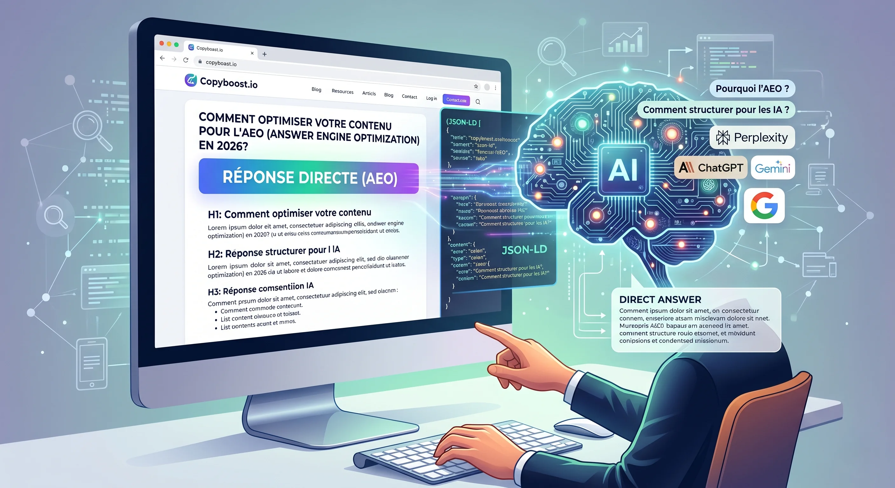

> **Réponse Directe AEO :** L'optimisation pour les moteurs de réponse AEO consiste à structurer votre contenu avec une sémantique HTML5 claire (`<article>`, `<main>`), des réponses directes condensées paragraphes de moins de 60 mots et des données structurées JSON-LD précises. L'objectif est de permettre aux IA génératives Gemini, ChatGPT, Claude de scanner, comprendre et extraire facilement votre contenu comme source de confiance.



Le SEO classique est mort, vive l'AEO ! Si vous lisez ceci, vous savez déjà que les règles du jeu ont changé. La recherche n'est plus une simple liste de liens bleus. En 2026, l'IA est devenue l'intermédiaire principal entre l'information et l'utilisateur. Pour que votre expertise soit citée par un LLM Large Language Model comme Perplexity ou Gemini, il ne suffit plus de plaire à Google, il faut être "compris" par la machine, tout en restant profondément humain.

## Pourquoi l'AEO est-il devenu votre nouvelle priorité de visibilité ?

L'avènement des moteurs de réponse conversationnels a transformé l'intention de recherche. L'utilisateur pose une question complexe et attend une réponse immédiate, synthétisée et sourcée. La Search Generative Experience"SGE"de Google et les outils comme ChatGPT deviennent les nouveaux filtres. Si votre contenu n'est pas structuré pour être extrait comme une "réponse directe", vous n'existez plus dans ces nouveaux canaux de trafic. L'AEO n'est pas une option, c'est la condition de votre survie numérique.

## Comment structurer un article pour qu'il soit "digeste" pour les IA ?

C'est ici que la technique rencontre la création de contenu. Vous devez donner des indices sémantiques clairs aux algorithmes.

### 1. Formulez vos sous-titres comme les questions exactes des utilisateurs

Les IA sont conçues pour mapper des questions à des blocs d'information. Ne vous contentez pas de `## Déploiement Vercel`. Utilisez plutôt `## Comment déployer Astro sur Vercel facilement ?`. En utilisant des H2 et H3 interrogatifs, vous facilitez ce mapping et augmentez vos chances d'être cité.

### 2. La règle du "Nugget" de contenu : La réponse d'abord, l'explication après

Identifiez l'information essentielle de chaque section. Juste après votre titre H1 ou H2, placez un paragraphe condensé le "Nugget" qui résume la réponse principale en 2 ou 3 phrases claires. C'est exactement ce que nous avons fait avec la boîte de "Réponse Directe AEO" en haut de cet article. C'est le format idéal pour l'extraction.

### 3. Exploitez les Données Structurées JSON-LD comme jamais

C'est le point le plus important. Injectez dynamiquement un script JSON-LD de type Article ou BlogPosting dans le `<head>` de votre layout Astro. Remplissez ce JSON avec des variables riches (titre, description, date de publication, date de mise à jour, nom de l'auteur : Samwane ABDALLAH). Le JSON-LD est le langage natif des IA pour comprendre le contexte.

```html
<script type="application/ld+json" set:html={JSON.stringify(schemaData)} />
```

## Quels sont les outils indispensables pour mesurer votre impact AEO ?

Il est crucial de surveiller vos performances non seulement sur la Google Search Console, mais aussi votre taux de citation dans les outils de réponse conversationnels. Des plateformes spécifiques commencent à émerger pour suivre le "AEO Ranking" et analyser la sémantique de vos réponses face aux requêtes des utilisateurs. Vous devez aussi tester la validité de votre structure JSON-LD.

## Conclusion : L'authenticité reste le filtre final de l'E-E-A-T

Même si nous codons pour les machines, le contenu est lu par des humains. Le "Build in Public", le partage de vrais bugs, de vos échecs et de vos solutions concrètes renforcent votre E-E-A-T (Expérience, Expertise, Autorité, Fiabilité) aux yeux de Google et des IA. Les IA sont programmées pour détecter l'authenticité et la fraîcheur du contenu. Optimisez pour la structure, mais créez pour l'humain. C'est la seule stratégie durable.
